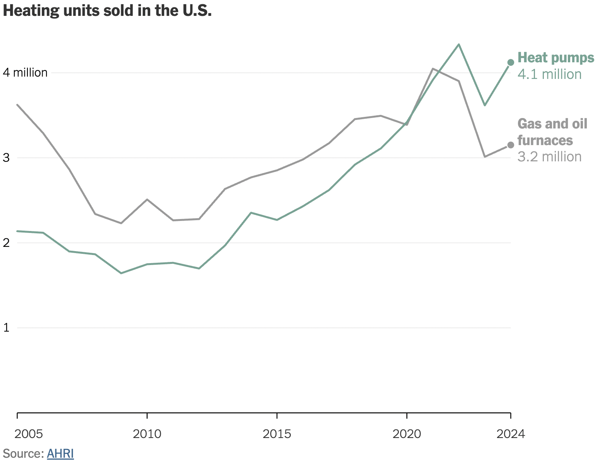
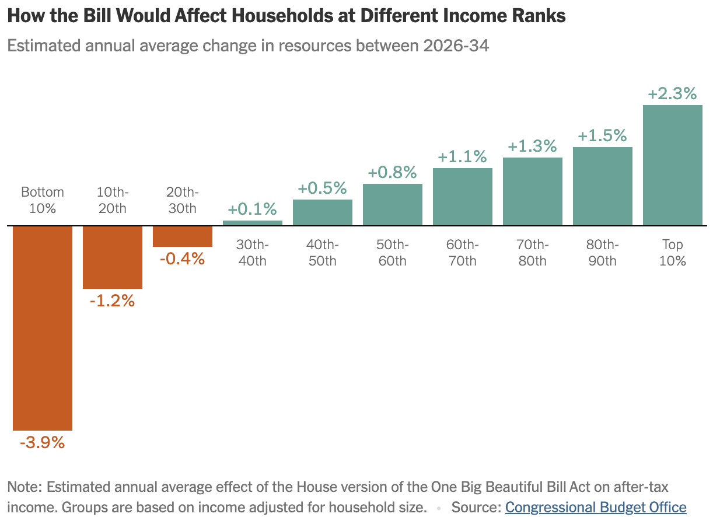

# About

This repo houses the code from my series of YouTube videos where I walk through how to recreate NY Times charts in R. Find a playlist with all the videos [here](https://www.youtube.com/playlist?list=PL13MEsHNi98LPKpbNepEZ9wIHW08pWi2v).

## [Heating Unit Sales](./nyt_heating_unit_sales/)

## [Big Beautiful Bill Impact on Households](./nyt_bbb_impact/)

